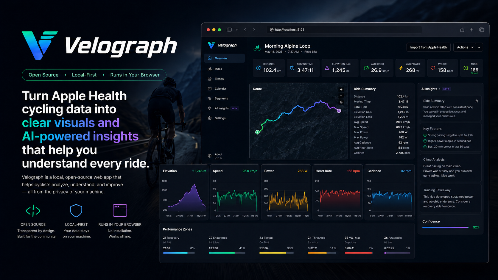

<p align="center">
  
</p>

# Velograph

**Turn Apple Health cycling data into clear, private visuals and deterministic insights.**

Velograph is a local-first web app for cyclists in a public source repository. It imports Apple Health cycling exports (via [Health Auto Export](https://www.healthyapps.dev/) CSV/GPX/ZIP), stores them in a local SQLite database, calculates deterministic ride and conditioning metrics, and reconstructs routes entirely offline. The workspace also contains opt-in, evidence-validated Codex CLI and Ollama insight runtimes; the current API and web app keep AI disabled and do not yet expose provider configuration or generation.

## Privacy stance

Your health data never leaves your machine unless you explicitly send it somewhere.

- **Local first.** All data lives in a local data directory (`VELO_DATA_DIR`) outside the source checkout, in SQLite you can inspect, back up, and delete.
- **Offline by default.** No telemetry, CDNs, remote fonts, map tiles, or geocoding. The app binds to `127.0.0.1` and renders every chart and route view without a network connection.
- **AI explains; it does not calculate.** Every number comes from the deterministic analytics engine. AI is disabled by default, never required, and receives only a versioned, minimized JSON payload — never raw time-series, coordinates, or source files.
- **Public repo, zero personal data.** Only synthetic fixtures (invented values, invented dates, invented routes) may enter this repository, enforced by a default-deny `.gitignore`, a pre-commit privacy scanner, and blocking CI checks.

## Quick start

The build system is a pnpm/TypeScript monorepo with a working import pipeline, analytics
engine, loopback API, and web client. Use Node.js `^20.19.0 || >=22.12.0 <27` and the
repository-pinned pnpm `10.34.5`.

Use an already-installed pnpm binary whose `pnpm --version` reports `10.34.5`; project commands
do not install or update the package manager on demand. Once a lifecycle command starts, its
packaging phase executes the checked-in Node build scripts directly instead of resolving another
package-manager shim. The production container runs only Node and `tini`, never pnpm.

```bash
pnpm install   # install workspace dependencies
pnpm dev       # build the API runtime, then run it with a live Vite UI
```

`pnpm dev` builds and runs `apps/api/dist/velograph-api.mjs`, then owns both foreground
processes: press Ctrl-C once to stop both. Its proxy rewrites only the configured loopback
development Origin and Host, so the API's DNS-rebinding and cross-origin protections remain
strict. For the built background app on port 5123, use `pnpm app:start` as documented below.

### Try it with the synthetic fixtures

**Do not import the synthetic fixtures into a data directory that holds real rides.**
Ride deletion exists, but a fixture import can still create several linked workouts. Point this
walkthrough at an explicit throwaway directory so the demo never touches real data:

```bash
export VELO_DATA_DIR=$(mktemp -d)                        # throwaway directory for this demo
pnpm cli:build
pnpm velograph-import import fixtures/synthetic/rides
pnpm dev
```

Then open `http://127.0.0.1:5124` in your browser. `VELO_DATA_DIR` stays set for the rest of
this shell session, so the API command above serves the same fixture rides you just
imported. Close the shell (or `unset VELO_DATA_DIR`) when you're done, and delete the
temporary directory if you want to reclaim the space.

### Import your own data

When you're ready to use a real [Health Auto Export](https://www.healthyapps.dev/) export,
start a fresh shell (so the throwaway `VELO_DATA_DIR` above is gone) and either set
`VELO_DATA_DIR` explicitly to where your real database should live, or leave it unset —
Velograph then picks an OS-appropriate application-data directory: `~/Library/Application
Support/velograph` on macOS, `%APPDATA%\velograph` on Windows, or
`$XDG_DATA_HOME/velograph` (falling back to `~/.local/share/velograph`) on Linux. Either way,
all persistent state — the SQLite database, quarantined import files — lives there, never
inside this checkout; a `VELO_DATA_DIR` that resolves inside a git checkout is refused at
startup.

Managed `app:start` logs are owner-only and retain at most one current and one previous
generation. Each generation defaults to 5 MiB. Set `VELO_LOG_MAX_BYTES` to a whole number
from 65536 through 104857600 before starting the app to choose a different bounded retention
size; payloads, filenames, coordinates, and metric values are never intentionally logged.

```bash
pnpm cli:build
pnpm velograph-import import /path/to/your/health-auto-export
pnpm app:start
```

Import the **whole export folder**, not individual files. Health Auto Export writes one CSV
per metric — heart rate, cadence, distance, and energy each arrive in their own file, with
the route as a separate GPX. Importing a single CSV produces a ride with only that one
metric. Files are associated into a single workout by type and overlapping sample range, so
companion files still join correctly if they arrive in a later import.

The web client's Import page can do the same thing without the CLI: paste the export folder's
path into the "Import from a folder path" field and preview it before confirming. The API
reads the folder directly from disk — the same way the CLI does, recursively, bounded by a
file-count/total-size cap — rather than uploading every file through the browser as base64,
which does not scale to a real export (a single route GPX alone runs a couple of megabytes,
and a folder holds dozens of files across many rides). Confirmation revalidates the selected
tree and reads one bounded ride group at a time while keeping the whole confirmed import
atomic; it never holds the entire folder in memory. The preview groups files by ride (workout
type + the filename's trailing timestamp) so it's obvious which companion files belong
together before anything is imported. Before confirmation, every planned file is evaluated by
the real parser, content-hash duplicate check, and database-backed workout association rules
inside a rollback-only transaction. The preview therefore reports exact recognized, duplicate,
ambiguous, invalid, unsupported, unmodelled-metric, and non-cycling outcomes without creating an
import batch, workout, source row, or sample. The preview response contains relative entry metadata and
an opaque confirmation token, never the requested or canonical absolute folder path. The
multi-file picker and loose-file drag-and-drop
remain useful for small selections: each exact file is reviewed by the local API before the
Confirm button appears using those same parser and database rules, and files with the
same name and size remain distinct. Browser uploads enforce count, per-file, aggregate decoded,
and encoded-request limits and encode one file at a time; use folder path import when a selection
exceeds them. Compressed ZIP contents inherit those same per-file and aggregate decoded-byte
limits. When a local desktop runtime exposes a nonstandard absolute `File.path`, a folder drop is
accepted as a path only after every file maps to one root through an independently constructed
relative suffix; Velograph then populates the path field and starts the same disk-backed preview.
Standard browsers do not expose that absolute path, so they fall back visibly to the bounded
loose-file picker and direct large exports to the paste-path workflow. Virtual
`FileSystemEntry.fullPath` values are never treated as OS paths.

The versioned CSV adapter accepts units only when the header states them explicitly. Distance
supports `km` and `m`; energy supports `kJ`, `J`, and `kcal`; route altitude and accuracy support
`m` and `ft`; route speed supports `m/s` and `km/h`; and route course supports `deg`. Values are
converted to canonical metres, joules, metres per second, and degrees before storage. A generic
`Distance`, `Energy`, `Altitude`, or `Speed` header — or any unsupported unit — is quarantined
with the value-free `unit_unsupported` code rather than guessed.
The filename metric label must also agree with those headers before rows are normalized. CSVs
are capped at 32 MiB and 500,000 samples and are parsed without retaining a second full row
matrix; bound failures use the value-free `csv_limits_exceeded` code. GPX is accepted only when
its canonical cycling filename identifies it as `Route`.

Every web review, folder scan, and confirmed import has a visible Cancel action. Cancellation
stops browser file encoding or aborts the loopback request; the API propagates request/response
disconnects into the importer. The importer observes that signal at bounded file/group, CSV
parse/normalization, and 2,048-row database-insert checkpoints as well as before commit; an
observed cancellation rolls the complete SQLite transaction back.

### Managing the local server

Two ways to run it, background or foreground:

```bash
pnpm app:dev       # foreground: build, start, open the browser; Ctrl-C stops everything
```

`app:dev` is the everyday workflow — one command builds the web client and packaged API,
starts `apps/api/dist/velograph-api.mjs` in the foreground of your terminal, and opens it in
your browser once it answers. Ctrl-C (or a `kill`) tears it down cleanly: the exact API child
is signaled, waited on, and force-killed if it doesn't exit in time, so nothing is ever left
holding the port after you stop it.

```bash
pnpm app:start     # background: same build+wait-for-ready, but detached
pnpm app:status    # running? which pid, port, data directory, and how many rides
pnpm app:restart   # pick up code changes
pnpm app:stop      # clean no-op if nothing is running
```

Use the background commands when you want a server that outlives the current shell (or a
session that needs to run something else in the same terminal). `app:status` is safe to run
at any time. `app:start` builds the web client and API package, forces a loopback bind, and
waits for a health response whose version, listener PID, and command all identify the child it
started. An unrelated listener is reported as unverified and is never labeled or signaled as
Velograph. Server output goes to a log file whose path `app:start` and `app:status` print.
The log is owner-only, rotates to one previous generation at 5 MiB, and refuses symlink or
non-regular targets. Both the current and previous generations are hard-capped while the API is
running; a detached local sink drains through shutdown and tightens any retained legacy file to
owner-only permissions. (Process lookup uses `lsof`; on Windows use Task Manager to stop a stray
server.)

## Run with Docker Compose

The supported container deployment is local-only. It publishes the app at
`http://127.0.0.1:5123`, keeps the API loopback-only inside the container, and
stores persistent state in Docker's local `velograph-data` volume. It never
mounts a source export, Codex credentials, a host home directory, or a path in
this checkout.

```bash
docker compose up --build
```

Stop it with `docker compose down`. The data volume intentionally remains so a
normal stop does not delete rides. Removing that volume deletes the local app
data; use Velograph's backup/delete workflow and read `docs/data-management.md`
before doing so. Do not change the checked-in `127.0.0.1:5123:5123` port mapping
to a wildcard or LAN address: the app has no authentication for network use.
The image defaults its ingress relay to container loopback, so a bare
`docker run -p 5123:5123 …` does not opt into network-reachable service.
Compose explicitly binds the relay to the container network only while keeping
the host publication on `127.0.0.1`; preserve both halves of that contract.

The runtime is read-only except for its data volume and a small temporary
filesystem. The final image serves the audited client embedded in the API
production deployment; there is no duplicate web asset tree. The entrypoint
supervises the API and ingress relay together, the healthcheck probes that
published ingress, and Compose allows 25 seconds for coordinated shutdown. Build tools,
development dependencies, and reviewed install-only compiler/archive material
remain outside the runtime stage. For an advanced external-volume setup, create
a local ignored Compose override and mount only a directory outside the
checkout. Never mount an export folder or credential cache into the container.

Run the test suite and the other checks CI runs:

```bash
pnpm test         # unit, parser, migration, and analytics golden tests
pnpm lint         # eslint
pnpm typecheck    # tsc --noEmit across every workspace package
pnpm format       # prettier --check
pnpm runtime:build
pnpm runtime:verify-artifacts
pnpm api:verify-package
pnpm cli:verify-package
pnpm license:check
pnpm package:web
node scripts/privacy-scan.mjs --all   # privacy/data-leak scan
```

With the app serving an imported synthetic ride, a release candidate can also exercise the
actual offline Leaflet map in a caller-supplied Chromium build. The smoke uses a disposable
browser profile, requires a loopback URL, verifies controls, route geometry, markers, scale,
keyboard panning, chart/map cursor synchronization, and a locally served basemap tile, and emits
only fixed pass/failure codes:

```bash
VELO_BROWSER_SMOKE_CHROME=/path/to/chromium \
VELO_BROWSER_SMOKE_URL=http://127.0.0.1:5123 \
VELO_BROWSER_SMOKE_RIDE_ID=1 \
pnpm browser:smoke:map
```

Use invented fixture rides for any release evidence. The command does not retain URLs, ride
values, screenshots, console messages, browser profiles, or source paths.

Backups are self-contained SQLite files with an app/schema manifest and deterministic table
checksums. Restore is destructive and therefore requires explicit confirmation:

```bash
pnpm velograph-import backup /safe/path/velograph.sqlite3
pnpm velograph-import restore /safe/path/velograph.sqlite3 --confirm-replace
```

## Project layout

```
apps/
  api/      loopback HTTP API (workouts, analytics, trends, import, settings)
  cli/      velograph-import — CSV/GPX/ZIP importer CLI
  web/      React client, built with Vite
packages/
  analytics/  deterministic ride/conditioning metrics (pure, versioned formulas)
  db/         SQLite schema, migrations, data-dir resolution
  importers/  CSV/GPX/ZIP parsing, normalization, workout association
  insights/   Opt-in AI provider runtimes, minimized payload, schema, and validation
  shared/     types and utilities shared across packages
fixtures/synthetic/   invented data used by tests and this quickstart
```

## Documentation

- [Product requirements (PRD)](Velograph-PRD.md) — the source of truth for all requirements
- [Repository guidelines](AGENTS.md) — structure, workflow, and privacy boundaries for contributors
- [Changelog](CHANGELOG.md) — what shipped, release by release
- [Release procedure](docs/releasing.md) — versioning scheme and how a release is cut
- [Runtime packaging](docs/runtime-packaging.md) — production bundles, artifact checks, and
  clean-install verification
- [Design system](docs/design-system.md) — palette, typography, and visual language
- [Offline route maps](docs/offline-basemap.md) — interactive route controls and optional local raster MBTiles setup
- [Analytics formulas](docs/formulas.md) — every metric definition, versioned
- [Data management](docs/data-management.md) — delete, backup, restore, and repair: cascade behaviour and the delete/re-import idempotency decision
- [AI insight privacy](docs/ai-privacy.md) — exact provider destinations, minimized payload, and validation boundary
- [CI supply-chain policy](docs/ci-supply-chain.md) — pinned-SHA GitHub Actions and how to update them
- [Third-party notices](THIRD_PARTY_NOTICES.md) — bundled dependency licences and notices
- [Release privacy audit](docs/release-privacy-audit.md) — worktree, history, artifact, and image-layer release checks
- [Third-party licence gate](docs/third-party-licences.md) — exact runtime inventory, canonical notices, and artifact checks
- [Threat model](docs/threat-model.md) — privacy/security boundaries and release evidence
- [Security policy](SECURITY.md) and [incident response](docs/privacy-incident-response.md) — report and contain vulnerabilities or privacy leaks

## License

No licence has been selected for Velograph (Apache-2.0 remains a PRD §20
recommendation only). Until a project licence is published, all rights are
reserved. Distributed dependencies retain their own terms; see
[Third-party notices](THIRD_PARTY_NOTICES.md).
